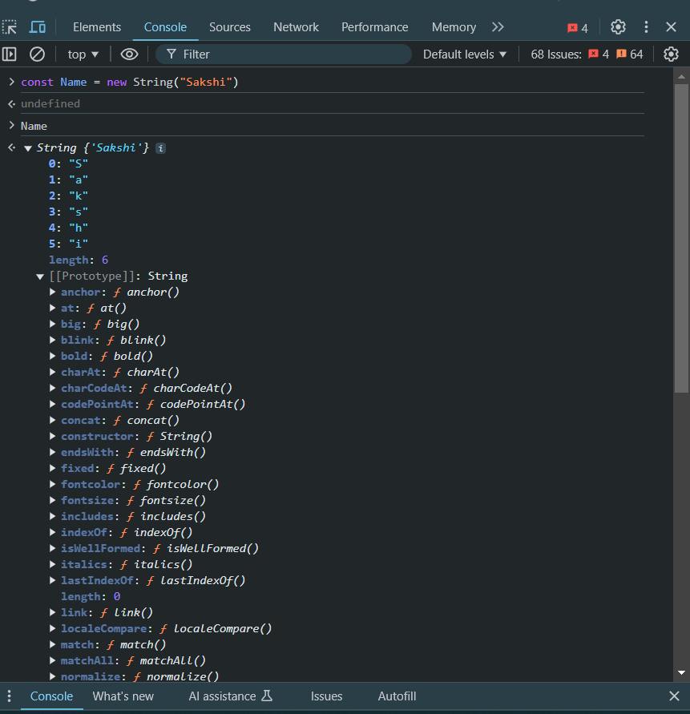

# 1. Introduction to JavaScript
JavaScript is a high-level, interpreted programming language used primarily for web development to create dynamic and interactive websites. It is often run in the browser to manipulate web page elements.
javascript is synchronous single threaded language.
# Created by: JavaScript was created by Brendan Eich at Netscape Communications in 1995.
Original name: Initially called Mocha, then renamed to LiveScript, and finally to JavaScript.
ECMAScript Standard: JavaScript is based on the ECMAScript (ES) specification, which is maintained by ECMA International. ES6 (ES2015) introduced many important updates, including classes, modules, arrow functions, promises, etc.

#  Why Use JavaScript?
Interactive Websites: JavaScript enables dynamic interaction within the webpage, like responding to user events, changing the content without reloading, etc.

Client-side Processing: JavaScript executes in the user's browser, reducing server load and providing a faster user experience.

Wide Usage: It's supported by all modern browsers and works seamlessly across different platforms.

Full-stack Development: JavaScript can be used for both front-end (with frameworks like React, Angular) and back-end (with Node.js), allowing for a full-stack development experience.

Asynchronous Programming: JavaScript handles asynchronous tasks (e.g., API calls, user inputs) via mechanisms like Promises and async/await.
# Types of Execution :
1. Synchronous 
2. Ashynchronus
# Synchronous Language
- Tasks performed sequenslly, meaning one task must complete before the starting of next.
- Execution blocks until the current tasks finish.
- eg: waiting in queue.

# Asynchronous
- Task can run independently
- Another task can start before the completion of first task.
- Non-blocking execution, means task runs parallely.
- API call, Callback function(setTimeout).

# Execution Context
- Execution context is an environment in which a script is executed.
- Evrything in javasript happens inside the execution context.
 # key concept of Execution Context
 1. Creatoin Phase
 2. Execution Phase

# Importance of JavaScript
Dominant Language for Web Development: JavaScript is essential for creating modern, feature-rich web applications.
Community & Ecosystem: A vast community of developers and a rich ecosystem of libraries and frameworks (e.g., React, Vue, Angular) provide powerful tools for developers.
Cross-Platform Development: JavaScript can be used to develop not only websites but also mobile applications (using React Native) and desktop applications (using Electron).
Non-blocking I/O: JavaScript can handle numerous simultaneous operations without blocking the main thread, improving performance and responsiveness.

# 2. let, const, and var
var: The original way to declare variables. Its scope is function-wide and can be re-assigned. However, it can lead to bugs due to its hoisting and function-scoped behavior.
let: Introduced in ES6, let is block-scoped and allows reassignment of values, unlike const. It's preferable to var as it avoids some issues related to variable scoping.
const: Also block-scoped, but the value cannot be reassigned after initialization. It's used when the variable value should remain constant.
Example:

```javascript
var x = 10;
let y = 20;
const z = 30;

x = 15; // allowed
y = 25; // allowed
z = 35; // error: assignment to constant variable
```

# 3. Data Types
JavaScript supports several types of data, categorized as primitive types and reference types.

# Primitive Data Types:
1. String: A sequence of characters, enclosed in single, double, or backticks.
2. Number: Represents both integers and floating-point numbers.
3. BigInt: Represents integers larger than the range of the Number type.
4. Boolean: Represents true or false.
5. undefined: Represents an uninitialized variable.
6. null: Represents a null or empty value.
7. Symbol (ES6): Represents a unique, immutable value.

# Non-Primitive (Reference) Data Types:
1. Object: Collections of key-value pairs (including arrays and functions).
2. Array: A type of object for storing ordered collections.
3. Function: A special object that can be invoked to perform actions.

# 4. String to Number Conversion

JavaScript provides multiple ways to convert strings to numbers:
parseInt(): Converts a string to an integer.
parseFloat(): Converts a string to a floating-point number.
Number(): Converts a string to a number, which can be either integer or floating-point.
Unary Plus (+): A shorthand to convert a string to a number.
Examples:

```javascript
let str = "123";
let num1 = parseInt(str);   // 123
let num2 = parseFloat(str); // 123
let num3 = Number(str);     // 123
let num4 = +str;            // 123
```

5. Comparison of Data Types in JavaScript (typeof Operator)

typeof Operator: Used to check the data type of a value.
Examples:

```javascript
typeof "Hello"      // "string"
typeof 123          // "number"
typeof true         // "boolean"
typeof undefined    // "undefined"
typeof null         // "object" (this is a quirk ofJavaScript)
typeof {}           // "object"
typeof []           // "object" (arrays are objects)
typeof function(){} // "function" 
```

# 6. Operators in JavaScript
JavaScript includes several types of operators:

Arithmetic Operators: +, -, *, /, %, ++, --
Assignment Operators: =, +=, -=, *=, /=, %=``
Comparison Operators: ==, ===, !=, !==, >, <, >=, <=
Logical Operators: && (AND), || (OR), ! (NOT)
Bitwise Operators: &, |, ^, <<, >>, >>>
Ternary Operator: condition ? expr1 : expr2 (shorthand for if-else)
Nullish Coalescing Operator (??): Returns the right operand when the left is null or undefined.

# 7. Stack and Heap Memory in JavaScript
Stack Memory:

- Used for: storing primitive values (e.g., Number, String, Boolean, null, undefined, Symbol, BigInt) and function calls.
- Memory allocation: Automatically managed (Last-In-First-Out).
- Fast access: Since the stack operates on a fixed-size structure, it is much faster.
- Scope: Local execution context (Function execution creates a new stack frame).
- It operates in a Last In, First Out (LIFO) manner.
- Variables in the stack have a limited scope and are automatically cleared after execution.
```javascript
let x = 10;
let y = x;  // y gets a copy of x

x = 20;  // Changing x does not affect y
console.log(x); // 20
console.log(y); // 10
```
Since x is a primitive, y gets a copy of x, and modifying x does not affect y.

Heap Memory:

- Used for storing reference types (objects, arrays, functions).
- Objects stored in the heap are dynamically allocated and can be accessed by reference.
- Memory is managed through garbage collection, which periodically clears unused objects.
- Used for: Storing objects, arrays, and functions.
- Memory allocation: Dynamically allocated.
- Slower access: Since it involves references and dynamic allocation.
- Scope: Global and accessible as long as there’s a reference to it.

```javascript
let obj1 = { name: "Sakshi" };
let obj2 = obj1; // obj2 gets a reference to obj1

obj1.name = "Mehra"; // Changing obj1 also affects obj2
console.log(obj1.name); // "Mehra"
console.log(obj2.name); // "Mehra"
```
obj2 does not get a copy but a reference to the same object in the heap.
Changes to obj1 reflect in obj2 as well.

# 8. STRING in JavaScript

Strings are used to store and manipulate text. In JavaScript, strings are a sequence of characters enclosed in quotes. 
We can use:
Single quotes (' ')
Double quotes (" ")
Template literals (` `)
Declaring Strings

```javascript

// Using single quotes
let singleQuoteString = 'Hello, World!';

// Using double quotes
let doubleQuoteString = "JavaScript is fun!";

// Using template literals
let templateLiteralString = `Learning JavaScript strings!`;
```
String Properties and Methods

a. length
-
The length property returns the number of characters in a string.

```javascript
let str = "Hello, World!";
console.log(str.length); // Output: 13
```
b. Accessing Characters
-
You can access characters in a string using bracket notation or the charAt() method.

```javascript
let str = "JavaScript";
console.log(str[0]); // Output: J
console.log(str.charAt(4)); // Output: S
```
Common String Methods
-
1. Changing Case
```javascript

let text = "JavaScript";
console.log(text.toUpperCase()); // Output: JAVASCRIPT
console.log(text.toLowerCase()); // Output: javascript
```
2. Substring Extraction

substring(start, end)
slice(start, end)
```javascript
let text = "JavaScript";
console.log(text.substring(0, 4)); // Output: Java
console.log(text.slice(0, 4)); // Output: Java
console.log(text.slice(-6)); // Output: Script
```
3. Search Strings

includes(substring): Returns true if the substring exists.
indexOf(substring): Returns the first index of the substring.
lastIndexOf(substring): Returns the last index of the substring.
```javascript

let sentence = "Learning JavaScript is fun!";
console.log(sentence.includes("JavaScript")); // Output: true
console.log(sentence.indexOf("JavaScript")); // Output: 9
console.log(sentence.lastIndexOf("fun")); // Output: 23
```
4. Replacing Substrings

```javascript

let text = "I love JavaScript!";
console.log(text.replace("JavaScript", "coding")); // Output: I love coding!
```
5. Splitting Strings

The split() method splits a string into an array based on a delimiter.

```javascript
let sentence = "Split this into words";
console.log(sentence.split(" ")); // Output: ['Split', 'this', 'into', 'words']
```
6. Trimming Whitespaces
```javascript

let text = "   Hello, World!   ";
console.log(text.trim()); // Output: "Hello, World!"
```
7. Concatenating Strings

```javascript

let str1 = "Hello";
let str2 = "World";
console.log(str1 + " " + str2); // Output: Hello World
console.log(`${str1} ${str2}`); // Output: Hello World (using template literals)
```
Template Literals
Template literals (enclosed in backticks) allow embedding expressions and multi-line strings.

```javascript

let name = "Alice";
let greeting = `Hello, ${name}!`; // Embedding expression
console.log(greeting); // Output: Hello, Alice!

let multiline = `This is a 
multi-line string.`;
console.log(multiline);
```
Point to Remember 
-

Strings in JavaScript are versatile and come with a rich set of properties and methods. They allow you to perform tasks like searching, modifying, and formatting text easily. Let me know if you want help with specific string operations! 😊

IN CONSOLE :


These are some protypes of String in js
-